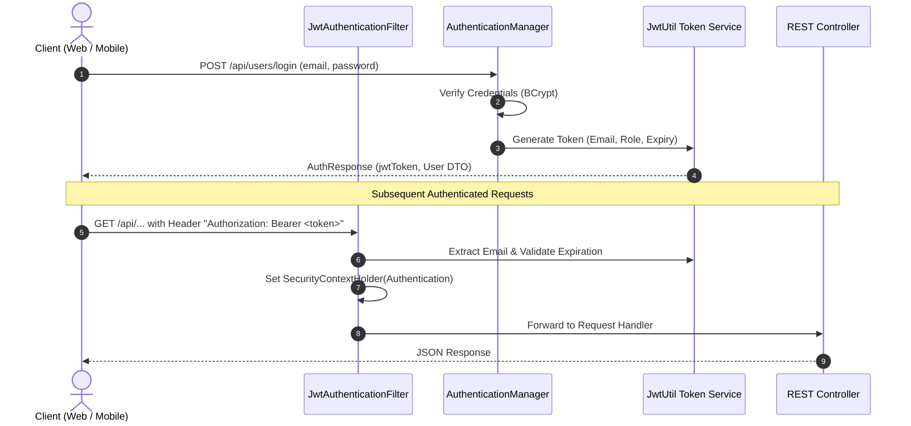
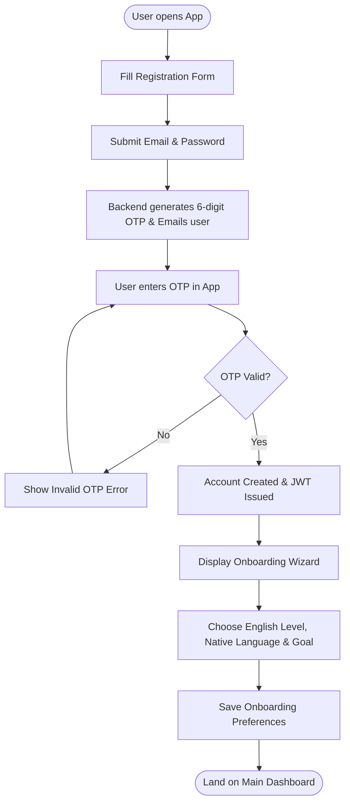
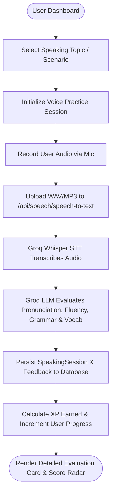
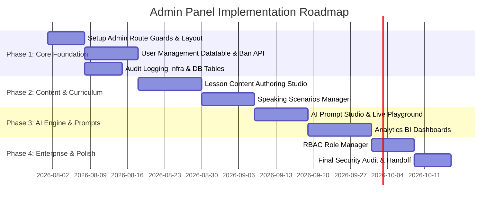

# SpeakMate AI — Admin Panel Master Technical Documentation & Implementation Plan

> **Single Source of Truth (SSOT)** for the design, architecture, database extension, backend APIs, and frontend implementation of the **SpeakMate AI Admin Panel**.
> 
> *Prepared for Development Teams, Product Owners, and System Architects.*

---

## Table of Contents

1. [Project Overview](#1-project-overview)
2. [Technology Stack](#2-technology-stack)
3. [Folder Structure](#3-folder-structure)
4. [Existing Features](#4-existing-features)
5. [Authentication & Authorization](#5-authentication--authorization)
6. [Database Documentation](#6-database-documentation)
7. [API Documentation](#7-api-documentation)
8. [User Flow Diagrams](#8-user-flow-diagrams)
9. [Admin Panel Overview](#9-admin-panel-overview)
10. [Admin Dashboard Specifications](#10-admin-dashboard-specifications)
11. [Admin Modules Inventory](#11-admin-modules-inventory)
12. [Detailed Admin Page Specifications](#12-detailed-admin-page-specifications)
13. [Role-Based Access Control (RBAC) Matrix](#13-role-based-access-control-rbac-matrix)
14. [Analytics & Reporting System](#14-analytics--reporting-system)
15. [Content Management Architecture](#15-content-management-architecture)
16. [Backend API Requirements for Admin Panel](#16-backend-api-requirements-for-admin-panel)
17. [Database Extensions (Recommended Changes)](#17-database-extensions-recommended-changes)
18. [Frontend Component & UI Requirements](#18-frontend-component--ui-requirements)
19. [UI/UX & Design Guidelines](#19-uiux--design-guidelines)
20. [Security & Compliance Recommendations](#20-security--compliance-recommendations)
21. [Development Roadmap & Phasing](#21-development-roadmap--phasing)
22. [Final Handoff & Checklists](#22-final-handoff--checklists)

---

## 1. Project Overview

### Project Name
**SpeakMate AI** (Enterprise AI-Powered Language Learning & Conversation Coaching Platform)

### Purpose
SpeakMate AI is an advanced, interactive English speaking and language coaching platform. It provides learners with real-time AI-driven conversation practice, instant grammar and pronunciation feedback, structured interactive lessons, vocabulary expansion tools, and gamified progress tracking (XP, levels, badges, streaks).

### Vision
To empower global language learners with a personalized, 24/7 hyper-realistic AI tutor that removes language anxiety, offers actionable pronunciation/grammar corrections, and tracks fluency development through measurable metrics.

### Target Users
- **Primary Learners**: Students, professionals, and job-seekers preparing for interviews, public speaking, or standardized tests (IELTS, TOEFL).
- **Secondary Users**: Casual language enthusiasts improving daily conversational fluency.
- **Administrative Users**: System Administrators, Content Curators, AI Prompt Engineers, Support Specialists, and Executive Analytics Viewers.

### Core Platform Capabilities
- Real-time text & voice conversation sessions with AI personas (Groq LLM + Whisper STT).
- Instant speech-to-text transcription and speech evaluation (Pronunciation, Fluency, Grammar, Vocabulary).
- Interactive multi-level lesson modules with XP rewards and unlocking mechanisms.
- Automated email notification engine and Expo push notifications.
- Personal dictionary (vocabulary builder) and grammar check history tracking.
- Gamification engine with daily streaks, level progression, badges, and activity heatmaps.
- Dual Account Mode (Student Standard Mode vs Individual User Mode with `null` `schoolGrade` database storage).
- Global Speech & Voice Engine (`speechHelper.js`) synchronizing AI personas, accents, speech rate, and TTS synthesis across all modules.
- High-tech 3D Spherical Robot Avatar (`Avatar3D.jsx`) with procedural eye/core glowing states and real-time lip-sync animations.
- Custom Glassmorphism Toast & Modal System (`ToastContext.jsx`, `ModalContext.jsx`) replacing native browser popups (`window.alert`, `window.confirm`).

### Current Implementation Status
- **Backend (Spring Boot)**: Fully functional REST API micro-service connected to PostgreSQL (Neon Cloud Direct DB), featuring JWT security, Groq LLM integration, Whisper STT integration, SMTP notification dispatchers, and grade resolution preserving `null` for individual users.
- **Web Frontend (React + Vite)**: Modern responsive web application built with Tailwind CSS, Lucide icons, Framer Motion, custom Toast & Modal popups, and React Router v6.
- **Mobile Application (Expo React Native)**: iOS/Android native app with custom audio recording, push notifications, and student vs individual user onboarding.
- **Admin Panel**: Currently initial scaffold only (`/api/admin` backend controller present with basic user list & dashboard endpoints; admin frontend screens present as unpopulated scaffold). **This document defines the complete architecture for building the production-ready Admin Panel.**

---

## 2. Technology Stack

| Category | Component / Library | Specification / Usage |
| :--- | :--- | :--- |
| **Backend Framework** | Java 17 / Spring Boot 3.x | Core API server, Business Logic, Security, JPA/Hibernate |
| **Database** | PostgreSQL (Neon Cloud Direct) | Managed relational database (`neondb` on AWS `ap-southeast-1`) |
| **Authentication** | Spring Security + JWT | Stateless JWT token authentication with BCrypt password hashing |
| **AI LLM Engine** | Groq API (`llama-3.3-70b-versatile`) | High-speed LLM for chat coaching, grammar analysis, hints |
| **Speech-To-Text (STT)** | Groq Whisper (`whisper-large-v3-turbo`) | Audio transcriptions and pronunciation analysis |
| **Email Service** | Spring Boot Mail Starter (Gmail SMTP SSL) | Verification codes, password resets, onboarding emails |
| **Push Notifications** | Expo Push Notifications API | Native push notifications sent to mobile clients |
| **Web Frontend** | React 18 + Vite | Single Page Application (SPA), React Router v6, Axios |
| **Mobile App** | React Native + Expo | Cross-platform mobile client (iOS / Android) |
| **Styling** | Tailwind CSS / Vanilla CSS | Responsive design, glassmorphism, dark/light themes |
| **Icons & Animations** | Lucide React / Framer Motion | Modern visual indicators and smooth state transitions |

---

## 3. Folder Structure

The workspace is organized into three primary repositories:

```
SpeakMate_AI/
├── SpeakMateAI/               # Java Spring Boot Backend Microservice
│   ├── src/main/java/com/rslsolution/speakmateai/
│   │   ├── config/            # SecurityConfig, CORS, App Configs
│   │   ├── controller/        # REST Endpoints (Admin, User, Lesson, AI, etc.)
│   │   ├── dto/               # Request & Response payload objects
│   │   ├── entity/            # JPA Data Entities (User, Lesson, ChatSession, etc.)
│   │   ├── enums/             # Role (USER, ADMIN), Category, Difficulty enums
│   │   ├── exception/         # Custom Business Exception handlers
│   │   ├── repository/        # Spring Data JPA Repositories
│   │   ├── scheduler/         # Cron schedulers (NotificationScheduler)
│   │   ├── security/          # JwtAuthenticationFilter, JwtUtil, LoggingFilter
│   │   ├── service/           # Business Logic Interfaces & Implementations
│   │   └── util/              # Utility helper classes
│   └── src/main/resources/    # application.properties, SQL migrations
│
├── SpeakMate AI/              # React + Vite Web Application
│   ├── src/
│   │   ├── components/        # Reusable UI components (Navbar, Sidebar, Cards)
│   │   ├── context/           # AuthContext, ThemeContext, State management
│   │   ├── hooks/             # Custom React hooks (useAuth, useAudioRecorder)
│   │   ├── pages/             # App Screens (Dashboard, Practice, Lessons, etc.)
│   │   ├── routes/            # App Routing & ProtectedRoute wrappers
│   │   ├── services/          # Axios API client functions
│   │   └── utils/             # Formatters, helpers, constants
│
└── SpeakMateAI-App/           # React Native Expo Mobile Application
    ├── src/
    │   ├── api/               # Mobile API service layer
    │   ├── components/        # Mobile UI components
    │   ├── navigation/        # React Navigation stack & tab navigators
    │   └── screens/           # Mobile screens (Admin scaffold, Auth, Practice)
```

---

## 4. Existing Features

### Current Feature Breakdown

#### 1. Authentication & Account Management
- **Description**: User registration with email OTP validation, login, Google OAuth integration, password reset via deep links/OTP, and account deletion workflow.
- **Frontend Flow**: User submits credentials or email -> OTP generated and emailed -> Token verified -> JWT stored in `localStorage` / `AsyncStorage`.
- **Backend Flow**: `UserController` -> `UserServiceImpl` -> `UserRepository` -> `JwtUtil` issue token.
- **Database Usage**: `users` table.
- **API Endpoints**: `POST /api/users/register`, `POST /api/users/login`, `POST /api/users/send-registration-otp`, `POST /api/users/forgot-password`, `POST /api/users/reset-password`.
- **Status**: ✅ Existing Feature.

#### 2. Onboarding & Personalization
- **Description**: Multi-step onboarding collecting native language, target English level (Beginner/Intermediate/Advanced), primary learning goal, daily minute target, and voice/accent preferences.
- **Frontend Flow**: Wizard UI -> Submits payload -> Updates user profile -> Redirects to Dashboard.
- **Backend Flow**: `OnboardingController` -> `OnboardingServiceImpl` updates `users` and inserts `onboarding` record.
- **Database Usage**: `users`, `onboarding` tables.
- **API Endpoints**: `POST /api/onboarding`, `GET /api/onboarding/user/{userId}`.
- **Status**: ✅ Existing Feature.

#### 3. AI Conversational Practice & Chat Coaching
- **Description**: Interactive text & voice chat with AI tutors. Features grammar correction, alternative sentence phrasing, vocabulary suggestions, bookmarking, and AI-suggested hints.
- **Frontend Flow**: User types message or records voice -> STT transcribes -> Sent to backend -> Groq API yields reply with embedded feedback -> Displayed in message bubble.
- **Backend Flow**: `AIChatController` / `AiController` -> `AIChatServiceImpl` -> `Groq` API client -> Saves `ChatSession` & `ChatMessage`.
- **Database Usage**: `chat_sessions`, `chat_messages`, `chat_bookmarks` tables.
- **API Endpoints**: `POST /api/chat/start`, `POST /api/chat/message`, `GET /api/chat/history`, `POST /api/chat/bookmark/{id}`, `GET /api/chat/hint/{id}`.
- **Status**: ✅ Existing Feature.

#### 4. Voice Speaking Practice & Audio Evaluation
- **Description**: Topic/Scenario based speaking sessions with live audio upload. Computes Scores for Pronunciation, Fluency, Grammar, and Vocabulary.
- **Frontend Flow**: Microphone recording -> File sent via multipart/form-data -> Groq Whisper STT transcribes -> Groq LLM evaluates audio quality.
- **Backend Flow**: `SpeechController` & `SpeakingSessionController` -> `SpeechServiceImpl` -> Groq API.
- **Database Usage**: `speaking_sessions`, `conversation_messages`, `conversation_feedback` tables.
- **API Endpoints**: `POST /api/speech/speech-to-text`, `POST /api/speech/pronunciation`, `POST /api/speaking-session/start`, `POST /api/speaking-session/submit`.
- **Status**: ✅ Existing Feature.

#### 5. Interactive Lesson System
- **Description**: Categorized lesson modules (Business, Travel, Daily Life, Academic) with difficulty tiers, requirements, objectives, content delivery, and completion XP rewards.
- **Frontend Flow**: Lesson catalog -> Filter by category/difficulty -> Lesson details -> Interactive content/quiz -> Progress updated.
- **Backend Flow**: `LessonController` -> `LessonServiceImpl` -> Updates `lesson_progress` and user `progress`.
- **Database Usage**: `lessons`, `lesson_progress`, `progress` tables.
- **API Endpoints**: `GET /api/lessons`, `GET /api/lessons/{id}`, `POST /api/lessons/start/{id}`, `PUT /api/lessons/complete/{id}`.
- **Status**: ✅ Existing Feature.

#### 6. Vocabulary & Grammar Management
- **Description**: Personal vocabulary storage with definitions, examples, difficulty levels, and grammar check audit logs.
- **Frontend Flow**: User saves words from chat or custom input -> Filtered by mastery state -> AI generates contextual examples.
- **Backend Flow**: `VocabularyController` & `GrammarController` -> Services -> `vocabulary` and `grammar_history` tables.
- **Database Usage**: `vocabulary`, `grammar_history` tables.
- **API Endpoints**: `POST /api/vocabulary/add`, `GET /api/vocabulary/list`, `POST /api/grammar/check`.
- **Status**: ✅ Existing Feature.

#### 7. Dashboard, XP, & Gamification Engine
- **Description**: Central dashboard summarizing daily goal completion percentage, current/longest streaks, cumulative XP, user level, and recent activity logs.
- **Frontend Flow**: Dashboard mount -> Parallel API fetch (`/api/dashboard/summary`, `/api/dashboard/daily-goal`, `/api/activity/recent`) -> Render stats widgets.
- **Backend Flow**: `DashboardController` -> `DashboardServiceImpl` aggregates `Progress`, `SpeakingSession`, and `LessonProgress`.
- **Database Usage**: `progress`, `achievements`, `notifications` tables.
- **API Endpoints**: `GET /api/dashboard/summary`, `GET /api/dashboard/daily-goal`, `GET /api/dashboard/weekly-progress`.
- **Status**: ✅ Existing Feature.

#### 8. Dual Account Type & School Grade Management
- **Description**: Supports `STUDENT` (grades 1st Std to 10th Std) and `INDIVIDUAL_USER` account types. Individual users store `schoolGrade = NULL` in the database without being forced to default values (`1st Std` / `5th Std`).
- **Frontend & Backend Sync**: `AuthContext.jsx`, `Onboarding.jsx`, `Profile.jsx`, `OnboardingServiceImpl.java`, `UserServiceImpl.java`, `AdminServiceImpl.java`.
- **Status**: ✅ Existing Feature (Verified & Implemented).

#### 9. Global Speech & Voice Engine
- **Description**: Centralized `speechHelper.js` manages AI voice personas (Friendly, Professional, Tutor, Energetic), accent, pitch, and speed multipliers. Applies global voice settings across `ConversationSession`, `ConversationChat`, `GrammarPractice`, `Vocabulary`, `LessonDetail`, `Dashboard`, and `SpeakingHistoryDetail`.
- **Status**: ✅ Existing Feature (Verified & Implemented).

#### 10. Custom Toast & Glassmorphic Modal Engine
- **Description**: Custom `ToastContext.jsx` and `ModalContext.jsx` system providing animated floating toasts and glassmorphic modal popups (`showConfirm`, `showAlert`), completely replacing native browser popups (`window.alert`, `window.confirm`).
- **Status**: ✅ Existing Feature (Verified & Implemented).

---

### Recommended Enhancements (Future Platform Upgrades)

- 💡 **Subscription & Monetization Engine**: Integration of Stripe/Razorpay for Premium Tier billing, coupon codes, and usage quota limits.
- 💡 **Live Teacher / Coaching Marketplace**: 1-on-1 scheduled sessions with human language coaches.
- 💡 **Enterprise Team Management**: Corporate admin accounts to manage employee learning cohorts and measure business English ROI.
- 💡 **AI Voice Customization Studio**: Custom voice synthesis selection (ElevenLabs integration) with custom accent controls.

---

## 5. Authentication & Authorization

### Overview
Authentication in SpeakMate AI is built on a **stateless JSON Web Token (JWT)** architecture enforced by Spring Security.



### Security Flow Specifications
1. **Password Encryption**: All passwords hashed using `BCryptPasswordEncoder` with cost factor 10.
2. **JWT Secret & Expiration**: Secret key defined via `jwt.secret`; default expiration set to 86,400,000 ms (24 Hours).
3. **Public Endpoints**:
   - `POST /api/users/register`, `/login`, `/send-registration-otp`, `/forgot-password`, `/reset-password`
   - `GET /api/lessons` (Public catalog browsing)
4. **Protected Endpoints**: All `/api/chat/*`, `/api/speaking-session/*`, `/api/dashboard/*`, `/api/profile/*` endpoints require a valid JWT header: `Authorization: Bearer <token>`.
5. **Role Hierarchy (Current State)**: Defined in `com.rslsolution.speakmateai.enums.Role`:
   - `USER`: Regular learning customer.
   - `ADMIN`: Administrator with full system privileges.
6. **Authorization Enforcement**: Endpoint security enforced via `@PreAuthorize("hasRole('ADMIN')")` or Spring Security Filter rules.

---

## 6. Database Documentation

The system utilizes PostgreSQL hosted on Neon Cloud Direct. Below is the complete relational schema specification of existing entities.

### Entity Relationship Diagram (ERD)

```mermaid
erDiagram
    users ||--o{ progress : owns
    users ||--o{ onboarding : submits
    users ||--o{ settings : manages
    users ||--o{ chat_sessions : conducts
    users ||--o{ speaking_sessions : performs
    users ||--o{ vocabulary : saves
    users ||--o{ grammar_history : checks
    users ||--o{ lesson_progress : tracks
    users ||--o{ notifications : receives
    users ||--o{ chat_bookmarks : bookmarks
    users ||--o{ achievements : unlocks

    chat_sessions ||--o{ chat_messages : contains
    speaking_sessions ||--o{ conversation_messages : contains
    speaking_sessions ||--o1 conversation_feedback : receives
    lessons ||--o{ lesson_progress : tracks
```

---

### Detailed Schema Specifications

#### 1. `users` Table
- **Purpose**: Stores account credentials, profile attributes, onboarding choices, and security flags.

| Column Name | Data Type | Constraints | Description |
| :--- | :--- | :--- | :--- |
| `id` | `BIGINT` | `PRIMARY KEY, AUTO_INCREMENT` | Unique user identifier |
| `first_name` | `VARCHAR(255)` | `NOT NULL` | User first name |
| `last_name` | `VARCHAR(255)` | `NOT NULL` | User last name |
| `email` | `VARCHAR(255)` | `NOT NULL, UNIQUE` | Account email address |
| `password` | `VARCHAR(255)` | `NOT NULL` | Hashed password (BCrypt) |
| `role` | `VARCHAR(50)` | `NOT NULL` | Enum: `USER`, `ADMIN` |
| `avatar` | `TEXT` | `NULLABLE` | URL or Base64 avatar image |
| `active` | `BOOLEAN` | `DEFAULT true` | Account status flag |
| `auth_provider` | `VARCHAR(50)` | `NULLABLE` | `LOCAL`, `GOOGLE` |
| `welcome_completed` | `BOOLEAN` | `DEFAULT false` | Welcome tour completion flag |
| `onboarding_completed`| `BOOLEAN` | `DEFAULT false` | Onboarding survey flag |
| `native_language` | `VARCHAR(100)` | `NULLABLE` | Native language (e.g. Hindi, Spanish) |
| `english_level` | `VARCHAR(50)` | `NULLABLE` | `Beginner`, `Intermediate`, `Advanced` |
| `school_grade` | `VARCHAR(50)` | `NULLABLE` | `NULL` for Individual Users; `1st Std` - `10th Std` for Students |
| `learning_goal` | `VARCHAR(255)` | `NULLABLE` | Learning motivation |
| `daily_goal_minutes` | `INTEGER` | `NULLABLE` | Target daily practice in minutes |
| `preferred_voice` | `VARCHAR(50)` | `NULLABLE` | Selected AI voice persona |
| `preferred_accent` | `VARCHAR(50)` | `NULLABLE` | Selected AI accent (US/UK/AU) |
| `expo_push_token` | `VARCHAR(500)` | `NULLABLE` | Push token for mobile notifications |
| `reset_otp` | `VARCHAR(10)` | `NULLABLE` | Temporary 6-digit OTP |
| `reset_otp_expiry` | `TIMESTAMP` | `NULLABLE` | OTP validity timestamp |
| `created_at` | `TIMESTAMP` | `NOT NULL, UPDA=FALSE` | Record creation timestamp |
| `updated_at` | `TIMESTAMP` | `NOT NULL` | Record modification timestamp |

---

#### 2. `lessons` Table
- **Purpose**: Stores course modules, learning content, difficulty metadata, and XP rewards.

| Column Name | Data Type | Constraints | Description |
| :--- | :--- | :--- | :--- |
| `id` | `BIGINT` | `PRIMARY KEY, AUTO_INCREMENT` | Unique lesson ID |
| `title` | `VARCHAR(255)` | `NOT NULL` | Lesson title |
| `category` | `VARCHAR(100)` | `NOT NULL` | Category (Business, Travel, Grammar) |
| `level` | `VARCHAR(50)` | `NOT NULL` | Difficulty level |
| `description` | `TEXT` | `NULLABLE` | Overview summary |
| `content` | `TEXT` | `NULLABLE` | HTML/Markdown lesson content |
| `xp_reward` | `INTEGER` | `DEFAULT 50` | XP points awarded on completion |
| `thumbnail` | `VARCHAR(500)` | `NULLABLE` | Thumbnail image URL |
| `cover_image` | `VARCHAR(500)` | `NULLABLE` | Banner image URL |
| `locked` | `BOOLEAN` | `DEFAULT false` | Lock status flag |
| `required_xp` | `INTEGER` | `DEFAULT 0` | Minimum XP required to unlock |
| `required_level` | `INTEGER` | `DEFAULT 1` | Minimum user level required |
| `estimated_minutes` | `INTEGER` | `DEFAULT 10` | Time required in minutes |
| `order_index` | `INTEGER` | `DEFAULT 0` | Display sequence order |
| `skills` | `TEXT` | `NULLABLE` | Comma-separated tags ("Fluency, Pronunciation") |
| `objectives` | `TEXT` | `NULLABLE` | Comma-separated goals |
| `popular` | `BOOLEAN` | `DEFAULT false` | Featured tag flag |
| `active` | `BOOLEAN` | `DEFAULT true` | Soft delete / publication flag |
| `created_at` | `TIMESTAMP` | `NOT NULL` | Creation timestamp |

---

#### 3. `speaking_sessions` Table
- **Purpose**: Stores voice conversation sessions, cumulative scores, and AI feedback.

| Column Name | Data Type | Constraints | Description |
| :--- | :--- | :--- | :--- |
| `id` | `BIGINT` | `PRIMARY KEY, AUTO_INCREMENT` | Unique session ID |
| `user_id` | `BIGINT` | `FOREIGN KEY (users.id)` | FK reference to user |
| `topic` | `VARCHAR(255)` | `NOT NULL` | Practice topic/scenario title |
| `scenario` | `VARCHAR(255)` | `NULLABLE` | Detailed scenario identifier |
| `transcript` | `TEXT` | `NULLABLE` | Full combined audio transcription |
| `duration` | `INTEGER` | `NOT NULL` | Duration in seconds |
| `xp_earned` | `INTEGER` | `DEFAULT 0` | Earned XP points |
| `overall_score` | `DOUBLE` | `DEFAULT 0.0` | Weighted aggregate score (0-100) |
| `pronunciation_score`| `DOUBLE` | `NULLABLE` | Pronunciation accuracy |
| `fluency_score` | `DOUBLE` | `NULLABLE` | Speech rate and pause analysis |
| `grammar_score` | `DOUBLE` | `NULLABLE` | Syntactical accuracy score |
| `vocabulary_score` | `DOUBLE` | `NULLABLE` | Lexical diversity score |
| `feedback` | `TEXT` | `NULLABLE` | AI tutor overall qualitative feedback |
| `created_at` | `TIMESTAMP` | `NOT NULL` | Session completion timestamp |

---

#### 4. `chat_sessions` & `chat_messages` Tables
- **Purpose**: Manages multi-turn AI text/voice chat coaching conversations.

**`chat_sessions`**:
- `id` (`BIGINT`), `user_id` (`FK`), `title` (`VARCHAR`), `scenario` (`VARCHAR`), `active` (`BOOLEAN`), `created_at` (`TIMESTAMP`).

**`chat_messages`**:
- `id` (`BIGINT`), `session_id` (`FK`), `sender` (`user`/`ai`), `message` (`TEXT`), `grammar_correction` (`TEXT`), `better_sentence` (`TEXT`), `vocabulary_suggestions` (`TEXT`), `explanation` (`TEXT`), `follow_up_question` (`TEXT`), `voice_enabled` (`BOOLEAN`), `created_at` (`TIMESTAMP`).

---

#### 5. `progress` Table
- **Purpose**: High-level aggregated telemetry and streak counters for a user.

| Column Name | Data Type | Constraints | Description |
| :--- | :--- | :--- | :--- |
| `id` | `BIGINT` | `PRIMARY KEY` | Unique ID |
| `user_id` | `BIGINT` | `FK (users.id), UNIQUE` | 1-to-1 relationship with User |
| `xp` | `INTEGER` | `DEFAULT 0` | Total Experience Points |
| `level` | `INTEGER` | `DEFAULT 1` | Current user level |
| `current_streak` | `INTEGER` | `DEFAULT 0` | Consecutive active practice days |
| `longest_streak` | `INTEGER` | `DEFAULT 0` | Best historical streak |
| `total_practice_minutes`| `INTEGER` | `DEFAULT 0` | Aggregate practice time |
| `total_speaking_sessions`| `INTEGER` | `DEFAULT 0` | Count of voice sessions completed |
| `total_grammar_checks` | `INTEGER` | `DEFAULT 0` | Count of grammar audits performed |
| `total_vocabulary_words`| `INTEGER` | `DEFAULT 0` | Count of saved dictionary words |

---

## 7. API Documentation

Complete catalog of active backend REST API endpoints implemented in `SpeakMateAI`.

### 1. User & Authentication Endpoints (`/api/users`)

| Method | Endpoint | Auth | Request Body | Response Payload | Description |
| :--- | :--- | :--- | :--- | :--- | :--- |
| `POST` | `/api/users/register` | Public | `RegisterRequest` | `UserResponse` | Creates a new user account |
| `POST` | `/api/users/login` | Public | `LoginRequest` | `AuthResponse` | Authenticates and returns JWT token |
| `POST` | `/api/users/send-registration-otp` | Public | `SendRegistrationOtpRequest` | `String` message | Sends email verification code |
| `POST` | `/api/users/forgot-password` | Public | `ForgotPasswordRequest` | `String` message | Generates password reset OTP |
| `POST` | `/api/users/reset-password` | Public | `ResetPasswordRequest` | `String` message | Resets password with valid OTP |
| `GET` | `/api/users/me` | JWT | None | `UserResponse` | Returns profile of current user |
| `GET` | `/api/users/get-all-users` | JWT | None | `List<UserResponse>` | Fetches all accounts |
| `PUT` | `/api/users/update-user/{id}` | JWT | `RegisterRequest` | `UserResponse` | Updates user details |
| `DELETE`| `/api/users/delete-user/{id}` | JWT | None | `String` message | Deletes user by ID |

---

### 2. Admin Management Endpoints (`/api/admin`)

| Method | Endpoint | Auth Required | Request Body | Response Payload | Description |
| :--- | :--- | :--- | :--- | :--- | :--- |
| `GET` | `/api/admin/dashboard` | JWT (Admin) | None | `AdminDashboardResponse` | System overview stats (total users, active sessions) |
| `GET` | `/api/admin/users` | JWT (Admin) | None | `List<UserResponse>` | Admin user list |
| `GET` | `/api/admin/users/{id}` | JWT (Admin) | None | `UserResponse` | Admin detailed user view |
| `PUT` | `/api/admin/users/activate/{id}` | JWT (Admin) | None | `UserResponse` | Unbans / activates user account |
| `PUT` | `/api/admin/users/deactivate/{id}`| JWT (Admin) | None | `UserResponse` | Bans / deactivates user account |

---

### 3. Lesson Management Endpoints (`/api/lessons` & `/api/lesson`)

| Method | Endpoint | Auth | Request Body | Response Payload | Description |
| :--- | :--- | :--- | :--- | :--- | :--- |
| `GET` | `/api/lessons` | Public | Query Params | `List<LessonResponse>` | Catalog listing with filters |
| `GET` | `/api/lessons/{id}` | Public | None | `LessonResponse` | Full details of a lesson |
| `POST` | `/api/lesson/create-lesson` | JWT (Admin) | `LessonRequest` | `LessonResponse` | Creates a new lesson module |
| `PUT` | `/api/lesson/update-lesson/{id}`| JWT (Admin) | `LessonRequest` | `LessonResponse` | Updates existing lesson |
| `DELETE`| `/api/lesson/delete-lesson/{id}`| JWT (Admin) | None | `String` message | Deletes lesson by ID |
| `POST` | `/api/lessons/start/{id}` | JWT | None | `LessonResponse` | Marks lesson as started |
| `PUT` | `/api/lessons/complete/{id}` | JWT | None | `LessonProgressResponse` | Completes lesson & awards XP |

---

### 4. AI Coaching & Chat Endpoints (`/api/chat` & `/api/ai`)

| Method | Endpoint | Auth | Request Body | Response Payload | Description |
| :--- | :--- | :--- | :--- | :--- | :--- |
| `POST` | `/api/chat/start` | JWT | `ChatStartRequest` | `ChatSessionResponse` | Starts new AI conversation session |
| `POST` | `/api/chat/message` | JWT | `ChatSessionMessageRequest` | `ChatMessageResponse` | Sends message & receives AI feedback |
| `GET` | `/api/chat/history` | JWT | None | `List<ChatSessionResponse>` | Retrieves active user chat sessions |
| `GET` | `/api/chat/session/{id}` | JWT | None | `ChatSessionDetailResponse` | Full message thread of a session |
| `POST` | `/api/chat/bookmark/{id}` | JWT | None | `Boolean` | Toggles message bookmark |
| `POST` | `/api/ai/grammar` | JWT | `AiRequest` | `AiResponse` | Analyzes text for grammar mistakes |
| `POST` | `/api/ai/speaking-feedback` | JWT | `AiRequest` | `AiResponse` | Generates speech feedback summary |

---

## 8. User Flow Diagrams

### 1. User Registration & Onboarding Flow



---

### 2. AI Speaking & Voice Evaluation Flow



---

## 9. Admin Panel Overview

### Purpose
The **SpeakMate AI Admin Panel** is a centralized operational control center. It grants administrators, support teams, and content managers real-time authority over system security, user accounts, AI prompts, curriculum content, analytics metrics, and system configuration.

### Operational Goals
1. **Total Operational Visibility**: Monitor DAU, MAU, session throughput, API latency, and LLM token usage.
2. **Curriculum Autonomy**: Create, edit, publish, and reorder lesson modules and speaking scenarios without deploying code.
3. **AI Persona Management**: Fine-tune system prompts, temperature settings, and model selections dynamically.
4. **User Governance**: Moderate accounts, inspect chat logs, adjust user XP/Levels, and handle support escalations.

### Architecture & Security Standard
- **Dedicated Admin Client**: Built as a secure sub-module or standalone React web dashboard.
- **Granular RBAC**: Enforces strict privilege barriers across 7 distinct administrative roles.
- **Audit Logging**: Every single administrative action (user ban, prompt update, content modification) is permanently recorded in an immutable audit ledger.

---

## 10. Admin Dashboard Specifications

The main entry point of the Admin Panel designed for instant executive insight.

```
+---------------------------------------------------------------------------------------------------+
|  SPEAKMATE AI ADMIN DASHBOARD                                          [Search...] [Super Admin v] |
+---------------------------------------------------------------------------------------------------+
|  [KPI CARDS]                                                                                      |
|  +--------------------+ +--------------------+ +--------------------+ +--------------------+  |
|  | Total Users        | | Daily Active (DAU) | | AI Sessions Today  | | Monthly Revenue    |  |
|  | 24,512 (+12% MoM)  | | 3,840 (84% Voice)  | | 14,290 Sessions  | | $18,450 (+8%)     |  |
|  +--------------------+ +--------------------+ +--------------------+ +--------------------+  |
+---------------------------------------------------------------------------------------------------+
|  [CHARTS ROW]                                                                                     |
|  +-----------------------------------------------+ +--------------------------------------------+ |
|  | User Growth & Session Volume (Last 30 Days)   | | Session Distribution by Type           | |
|  | [ Area Chart: DAU vs Speaking vs AI Chat ]    | | [ Pie Chart: Voice 60%, Chat 25%, Lesson ]| |
|  +-----------------------------------------------+ +--------------------------------------------+ |
+---------------------------------------------------------------------------------------------------+
|  [TABLE & FEED ROW]                                                                               |
|  +-----------------------------------------------+ +--------------------------------------------+ |
|  | Recent User Registrations & Status             | | System Alerts & AI Model Latency         | |
|  | User           Email        Date     Status   | | [OK] Groq API Latency: 320ms             | |
|  | John Doe   john@test.com  10m ago   ACTIVE    | | [WARN] High Whisper failure rate (1.2%)   | |
|  +-----------------------------------------------+ +--------------------------------------------+ |
+---------------------------------------------------------------------------------------------------+
```

### Key KPI Indicators
1. **Total Users**: Count of registered accounts with growth rate percentage.
2. **Daily Active Users (DAU)**: Count of unique active users in the past 24 hours.
3. **Speaking Sessions Today**: Total voice sessions conducted today.
4. **AI Token / API Cost**: Estimated real-time expenditure on Groq API calls.
5. **System Health Status**: Green/Yellow/Red indicator based on backend error rates.

---

## 11. Admin Modules Inventory

| Module Name | Implementation Status | Purpose & Scope |
| :--- | :--- | :--- |
| **1. Executive Dashboard** | ⚠️ Partial Backend | High-level metrics, real-time activity feeds, quick actions |
| **2. User Management** | ⚠️ Partial Backend | Manage profiles, active states, roles, reset passwords |
| **3. Role & RBAC Manager** | 💡 Recommended Future | Configure custom admin roles and permission matrices |
| **4. Lesson & Content Studio** | ⚠️ Partial Backend | Full WYSIWYG creation of lessons, units, and quizzes |
| **5. Speaking Scenarios Studio**| 💡 Recommended Future | Manage speaking practice topics, prompts, and criteria |
| **6. AI Tutor & Prompt Config** | 💡 Recommended Future | Tune Groq prompts, temperature, system instructions |
| **7. Voice & STT Engine Config** | 💡 Recommended Future | Manage speech recognition models, thresholds, timeouts |
| **8. Gamification & XP Rules** | 💡 Recommended Future | Configure level thresholds, badge triggers, daily goals |
| **9. Leaderboards & Streaks** | 💡 Recommended Future | Monitor top learners, inspect streak anomalies |
| **10. Subscriptions & Payments**| 💡 Recommended Future | Manage pricing tiers, stripe webhooks, active subs |
| **11. Coupons & Promotions** | 💡 Recommended Future | Create discount codes and promotional campaigns |
| **12. Push Notifications** | ⚠️ Partial Backend | Send broadcast push notifications and scheduled blasts |
| **13. Email Template Studio** | 💡 Recommended Future | Edit transactional email HTML templates dynamically |
| **14. System Analytics & BI** | 💡 Recommended Future | Deep cohort analysis, retention funnels, feature usage |
| **15. Support & Ticket Center** | 💡 Recommended Future | Resolve user support requests, account issues, feedback |
| **16. AI Conversation Inspector**| 💡 Recommended Future | Review flagged user-AI chats for safety and quality |
| **17. System Settings & Flags** | 💡 Recommended Future | Toggle feature flags, maintenance mode, global rate limits |
| **18. Audit Logs & Compliance** | 💡 Recommended Future | Immutable log of all administrative operations |

---

## 12. Detailed Admin Page Specifications

Below is the exhaustive specification for key primary Admin pages.

### Page 1: User Management (`/admin/users`)
- **Purpose**: Comprehensive administration of user accounts, state toggling, and role modification.
- **UI Components**: Filter Drawer, Multi-Select Bulk Bar, Datatable with inline avatar preview, Action Dropdown (`View Detail`, `Edit Profile`, `Deactivate Account`, `Reset Password`, `Impersonate`).
- **Filters**: Role Filter (`ALL`, `USER`, `ADMIN`), Status Filter (`ACTIVE`, `INACTIVE`/`BANNED`), Onboarding State, Date Range.
- **Bulk Actions**: Bulk Activate, Bulk Deactivate, Export CSV, Send Push Notification.
- **Forms**: User Edit Modal (First Name, Last Name, Email, Role, Daily Goal, Level, Password Override).
- **Permissions Required**: `users.read`, `users.write`, `users.ban`.
- **Required Backend APIs**: `GET /api/admin/users`, `PUT /api/admin/users/activate/{id}`, `PUT /api/admin/users/deactivate/{id}`, `POST /api/admin/users/export`.
- **Page States**:
  - *Loading*: Skeleton table rows.
  - *Empty*: "No users match the selected filters."
  - *Error*: Banner alert with retry button.
  - *Success*: Toast notification on action execution.

---

### Page 2: Lesson Content Studio (`/admin/lessons`)
- **Purpose**: Authoring and publishing curriculum lessons, ordering units, and setting XP values.
- **UI Components**: Tree view by Category, Drag-and-Drop Order Manager, Content Markdown/HTML Editor, Skill Tag Selector, Image Upload Dropzone.
- **Fields**: Title, Category, Level (`Beginner`, `Intermediate`, `Advanced`), Description, Markdown Content, XP Reward, Required XP, Required Level, Estimated Minutes, Skills Tags, Objectives.
- **Validation**: Title required (min 5 chars), Category required, XP Reward > 0.
- **Permissions Required**: `content.read`, `content.write`, `content.publish`.
- **Required Backend APIs**: `GET /api/lesson/get-all-lessons`, `POST /api/lesson/create-lesson`, `PUT /api/lesson/update-lesson/{id}`, `DELETE /api/lesson/delete-lesson/{id}`.

---

### Page 3: AI Prompt & Persona Engine (`/admin/ai-prompts`)
- **Purpose**: Live modification of system prompts powering the AI Tutor, Grammar Inspector, and Speaking Coach without requiring backend redeployment.
- **UI Components**: Persona Cards, System Prompt TextArea with syntax highlighting, Temperature Slider (`0.0` to `1.0`), Model Selector (`llama-3.3-70b-versatile`, etc.), Test Sandbox Chat Window.
- **Validation**: System prompt must contain `{user_input}` placeholder tag.
- **Permissions Required**: `ai_config.manage`.
- **Required Backend APIs**: `GET /api/admin/ai/prompts`, `PUT /api/admin/ai/prompts/{id}`, `POST /api/admin/ai/test-prompt`.

---

## 13. Role-Based Access Control (RBAC) Matrix

Permissions across 7 defined administrative roles:

| Module / Privilege | Super Admin | Admin | Moderator | Support | Content Manager | Teacher | Analytics Viewer |
| :--- | :---: | :---: | :---: | :---: | :---: | :---: | :---: |
| **User View (`users.read`)** | ✅ | ✅ | ✅ | ✅ | ❌ | ❌ | ✅ |
| **User Edit (`users.write`)** | ✅ | ✅ | ❌ | ❌ | ❌ | ❌ | ❌ |
| **User Ban/Unban (`users.ban`)**| ✅ | ✅ | ✅ | ❌ | ❌ | ❌ | ❌ |
| **Content Authoring (`content.write`)**| ✅ | ✅ | ❌ | ❌ | ✅ | ✅ | ❌ |
| **Content Publishing (`content.publish`)**| ✅ | ✅ | ❌ | ❌ | ✅ | ❌ | ❌ |
| **AI Prompt Config (`ai.config`)** | ✅ | ❌ | ❌ | ❌ | ❌ | ❌ | ❌ |
| **Financial / Revenue (`billing.read`)**| ✅ | ✅ | ❌ | ❌ | ❌ | ❌ | ✅ |
| **System Settings (`system.config`)** | ✅ | ❌ | ❌ | ❌ | ❌ | ❌ | ❌ |
| **Audit Logs (`audit.read`)** | ✅ | ✅ | ✅ | ❌ | ❌ | ❌ | ❌ |

---

## 14. Analytics & Reporting System

The Admin Panel includes dedicated BI and analytics dashboards powered by aggregated background SQL views:

1. **User Retention & Cohort Funnel**: Measures Day 1, Day 7, and Day 30 user retention after registration.
2. **Speaking Session Telemetry**:
   - Average session duration in seconds.
   - Average scores breakdown (Pronunciation vs Fluency vs Grammar vs Lexical).
   - Most practiced topics/scenarios.
3. **AI Operational Costs & Performance**:
   - Total Groq API token consumption.
   - Whisper STT error rate & average transcription delay (ms).
   - Average cost per active daily user.
4. **Curriculum Completion Funnel**: Identifies lessons with high drop-off rates or low completion scores.

---

## 15. Content Management Architecture

Content management in SpeakMate AI separates static assets, prompt templates, and curriculum nodes into a structured lifecycle:

```
[Draft State] --> (Content Manager Reviews) --> [Staging Test] --> (Super Admin Approves) --> [Published Production]
```

### CMS Managed Asset Types
1. **Lesson Modules**: Title, body markdown, quizzes, prerequisites, XP rewards.
2. **Speaking Scenarios**: Roleplay context, AI persona role instructions, initial greetings, expected vocabulary.
3. **Vocabulary Master Catalog**: Root dictionary definitions, CEFR difficulty level (A1-C2), example audio sentences.
4. **AI System Prompts**: System instructions for Groq chat, grammar correction rules, feedback templates.

---

## 16. Backend API Requirements for Admin Panel

Below is the list of new REST API endpoints required to support the complete Admin Panel.

### 1. User & Access Administration
- `GET /api/admin/users/search` — Paginated user query with sorting & filtering.
- `GET /api/admin/users/{id}/full-profile` — Aggregated user view with sessions, logs, and activity.
- `POST /api/admin/users/{id}/reset-password` — Force send password reset or trigger manual override.
- `PUT /api/admin/users/{id}/role` — Change assigned user role.

### 2. Analytics & Reporting
- `GET /api/admin/analytics/overview` — High-level metric cards (DAU, MAU, revenue, AI cost).
- `GET /api/admin/analytics/retention` — Cohort analysis data.
- `GET /api/admin/analytics/speaking-telemetry` — Voice evaluation metrics over time.
- `GET /api/admin/analytics/llm-usage` — Groq token usage and latency metrics.

### 3. Content Studio & Prompt Management
- `POST /api/admin/scenarios` — Create speaking practice scenario.
- `PUT /api/admin/scenarios/{id}` — Update speaking scenario.
- `GET /api/admin/ai/prompts` — Fetch active AI prompt templates.
- `PUT /api/admin/ai/prompts/{id}` — Live update an AI system prompt.

### 4. Audit Logs & System Control
- `GET /api/admin/audit-logs` — Query administrative audit logs.
- `POST /api/admin/system/maintenance` — Toggle system-wide maintenance mode.

---

## 17. Database Extensions (Recommended Changes)

> **Clarification**: The existing database schema remains untouched. The following new entities are **Recommended Database Additions** required for complete Admin Panel functionality.

```sql
-- 1. Administrative Audit Log Table
CREATE TABLE admin_audit_logs (
    id BIGSERIAL PRIMARY KEY,
    admin_user_id BIGINT NOT NULL REFERENCES users(id),
    action_type VARCHAR(100) NOT NULL, -- e.g., USER_BAN, PROMPT_UPDATE, LESSON_DELETE
    target_resource VARCHAR(100) NOT NULL,
    resource_id VARCHAR(100),
    details_json TEXT,
    ip_address VARCHAR(45),
    created_at TIMESTAMP NOT NULL DEFAULT CURRENT_TIMESTAMP
);

-- 2. AI System Prompt Templates Table
CREATE TABLE ai_prompts (
    id BIGSERIAL PRIMARY KEY,
    prompt_key VARCHAR(100) UNIQUE NOT NULL, -- e.g., CHAT_TUTOR_PROMPT, GRAMMAR_CHECK_PROMPT
    title VARCHAR(255) NOT NULL,
    system_prompt TEXT NOT NULL,
    temperature DOUBLE PRECISION DEFAULT 0.7,
    model_name VARCHAR(100) DEFAULT 'llama-3.3-70b-versatile',
    active BOOLEAN DEFAULT TRUE,
    updated_by BIGINT REFERENCES users(id),
    updated_at TIMESTAMP NOT NULL DEFAULT CURRENT_TIMESTAMP
);

-- 3. Speaking Scenarios Catalog Table
CREATE TABLE speaking_scenarios (
    id BIGSERIAL PRIMARY KEY,
    title VARCHAR(255) NOT NULL,
    category VARCHAR(100) NOT NULL,
    difficulty_level VARCHAR(50) NOT NULL,
    ai_role_description TEXT NOT NULL,
    initial_ai_message TEXT NOT NULL,
    target_vocabulary TEXT, -- Comma-separated target keywords
    active BOOLEAN DEFAULT TRUE,
    created_at TIMESTAMP NOT NULL DEFAULT CURRENT_TIMESTAMP
);
```

---

## 18. Frontend Component & UI Requirements

### Core UI Component Library Requirements
1. **DataTable (Advanced)**:
   - Server-side pagination, multi-column sorting, row selection.
   - Column visibility toggle, density toggle, CSV/Excel export.
2. **WYSIWYG Markdown Editor**:
   - Rich text formatting, live Markdown preview, inline image dropzone.
3. **Analytics Chart Engine**:
   - Area charts (user growth over time), bar charts (lesson completion rates), pie charts (device/voice distribution), radar charts (speaking score dimensions).
4. **JSON / Prompt Editor**:
   - Syntax-highlighted code editor with variable placeholder linting (`{user_message}`).
5. **Feedback & Modal System**:
   - Destructive action confirmation dialogs with double-confirmation typing (e.g. Type "DELETE").
   - Slide-over inspection panels for user activity logs.

---

## 19. UI/UX Guidelines

### Design System Token Specifications

| Token | Dark Mode Value | Light Mode Value | Description |
| :--- | :--- | :--- | :--- |
| **Primary Accent** | `#6366F1` (Indigo 500) | `#4F46E5` (Indigo 600) | Brand primary color, active states, CTA buttons |
| **Secondary Accent**| `#10B981` (Emerald 500) | `#059669` (Emerald 600) | Success indicators, XP badges, score high-lights |
| **Warning Accent** | `#F59E0B` (Amber 500) | `#D97706` (Amber 600) | Caution alerts, pending status, streak icons |
| **Destructive** | `#EF4444` (Red 500) | `#DC2626` (Red 600) | Ban user, delete lesson, drop table actions |
| **Background Root** | `#0F172A` (Slate 900) | `#F8FAFC` (Slate 50) | Page root background |
| **Card / Surface** | `#1E293B` (Slate 800) | `#FFFFFF` (White) | Component card surface background |
| **Border Tokens** | `#334155` (Slate 700) | `#E2E8F0` (Slate 200) | Input borders, table divider lines |

### Typography & Spacing
- **Font Family**: Inter, system-ui, -apple-system, sans-serif.
- **Heading Hierarchy**: H1 (28px Bold), H2 (22px Bold), H3 (18px SemiBold), Body (14px Regular), Small (12px Medium).
- **Spacing Grid**: 4px baseline grid (4px, 8px, 12px, 16px, 24px, 32px, 48px).

---

## 20. Security & Compliance Recommendations

1. **Strict Admin Endpoint Protection**:
   - Ensure all `/api/admin/*` endpoints strictly evaluate `@PreAuthorize("hasRole('ADMIN')")`.
2. **Session Hijacking Safeguards**:
   - Enforce short-lived JWT tokens for administrative sessions (e.g., 2 hours) with mandatory refresh token rotation.
3. **IP Allowlisting Option**:
   - Optional CIDR block IP filtering for Super Admin endpoints to restrict panel access to corporate VPNs.
4. **Audit Trail Completeness**:
   - No administrative write action (DELETE, UPDATE, INSERT) may execute without generating an immutable `admin_audit_logs` record.
5. **Data Anonymization in Logs**:
   - Ensure user chat logs displayed in moderation panels mask sensitive PII (passwords, credit cards, emails) automatically.

---

## 21. Development Roadmap & Phasing



### Phase Summary
- **Phase 1 (Weeks 1-3)**: Base Admin Layout, Protected Routing, Advanced User Management, Audit Log DB infrastructure.
- **Phase 2 (Weeks 4-6)**: Lesson Content Studio, Speaking Scenarios Manager, Vocabulary Catalog management.
- **Phase 3 (Weeks 7-9)**: AI Prompt & Persona Engine, Live Testing Sandbox, Telemetry & Analytics Dashboard.
- **Phase 4 (Weeks 10-12)**: Multi-role RBAC manager, System Settings, Load Testing, Final Security Audit.

---

## 22. Final Handoff & Checklists

### Frontend Team Implementation Checklist
- [ ] Create dedicated `/admin` route tree with `AdminLayout` wrapper (Sidebar, Topbar, Breadcrumbs).
- [ ] Implement `AdminProtectedRoute` guard verifying JWT role claims (`ROLE_ADMIN`).
- [ ] Build reusable `DataTable` component with server-side pagination, sorting, filtering, and CSV export.
- [ ] Build `UserManagement` page with inline status toggles, user view drawer, and edit modals.
- [ ] Integrate Markdown/HTML editor for `LessonStudio` page with live preview.
- [ ] Build `AnalyticsDashboard` integrating Recharts or Chart.js for DAU, revenue, and score visualization.
- [ ] Create `AiPromptStudio` with syntax highlighting and live prompt testing sandbox.
- [ ] Add toast notification system for feedback on admin operations.

### Backend Team Implementation Checklist
- [ ] Enforce `@PreAuthorize("hasRole('ADMIN')")` across all `/api/admin/**` endpoints.
- [ ] Implement `AdminAuditLog` interceptor / Aspect (AOP) to record administrative operations to `admin_audit_logs`.
- [ ] Execute database migrations for recommended tables (`admin_audit_logs`, `ai_prompts`, `speaking_scenarios`).
- [ ] Build paginated search endpoint `GET /api/admin/users/search` supporting filters and sorting.
- [ ] Implement `GET /api/admin/analytics/overview` returning consolidated DAU, MAU, session count, and token usage.
- [ ] Create CRUD endpoints for `ai_prompts` and dynamic prompt replacement in `AIChatServiceImpl`.
- [ ] Add export endpoint `POST /api/admin/users/export` generating streaming CSV responses.
- [ ] Conduct security audit to prevent privilege escalation vulnerabilities.

---

> **End of Master Documentation** — *SpeakMate AI Admin Panel Master Technical Specification v1.0*
